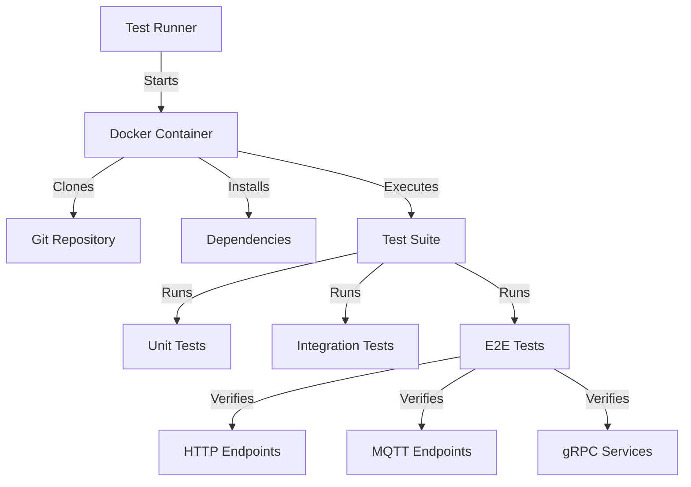
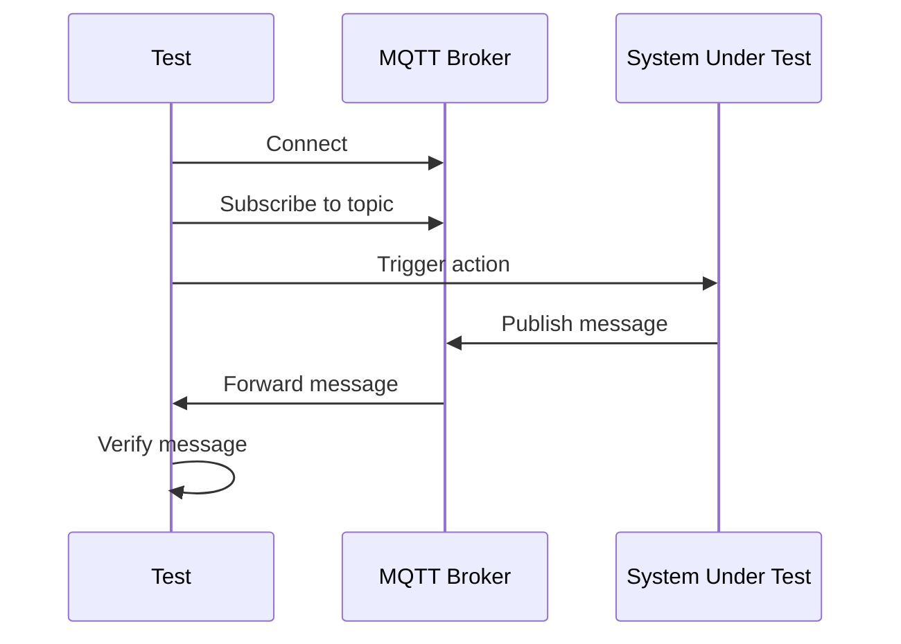
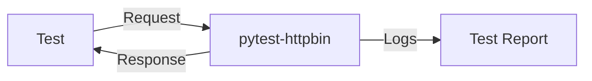

# DialogChain Testing Framework

Comprehensive end-to-end and integration testing for the DialogChain package.



## Architecture Overview

```
+---------------------+     +---------------------+     +---------------------+
|                     |     |                     |     |                     |
|   Unit Tests        |     |  Integration Tests  |     |   E2E Tests        |
|  (pytest)           |     |  (pytest)           |     |  (pytest + Docker) |
+----------+----------+     +----------+----------+     +----------+----------+
           |                           |                           |
           v                           v                           v
+----------+----------+     +----------+----------+     +----------+----------+
|                     |     |                     |     |                     |
|  Test Individual    |     |  Test Component     |     |  Test Full System  |
|  Functions/Classes  |     |  Interactions       |     |  in Production-like |
|                     |     |                     |     |  Environment       |
+---------------------+     +---------------------+     +---------------------+
```

## Features

- 🐍 **Python-based** testing with pytest
- 🐳 **Docker-based** isolated test environments
- 🔄 **Git integration** for version-controlled tests
- 📊 **Test coverage** reporting
- 🔌 **Multiple protocol support**:
  - HTTP/HTTPS endpoints
  - MQTT messaging
  - gRPC services
- 🎨 **Color-coded** test output
- ⚙️ **Configurable** through environment variables

## Prerequisites

- Docker 20.10+
- Docker Compose (for local development)
- Python 3.8+ (for local test development)
- Git (for local development)

## Quick Start

### 1. Build the Test Environment

```bash
docker build -f Dockerfile.test -t dialogchain-test-env .
```

### 2. Run All Tests

```bash
# Using HTTPS (recommended)
docker run --rm -it dialogchain-test-env \
  -e REPO_URL=https://github.com/dialogchain/python.git \
  -e BRANCH=main \
  -e 'MAKE_TARGETS="test"' \
  -e 'PYTHON_DEPS="pytest pytest-cov"'

# For SSH access (requires SSH agent forwarding)
eval $(ssh-agent -s)
ssh-add ~/.ssh/id_rsa  # or your private key
docker run --rm -it \
  -v /run/host-services/ssh-auth.sock:/run/host-services/ssh-auth.sock \
  -e SSH_AUTH_SOCK="/run/host-services/ssh-auth.sock" \
  dialogchain-test-env \
  -e REPO_URL=git@github.com:dialogchain/python.git \
  -e BRANCH=main \
  -e 'MAKE_TARGETS="test"'
```

## Test Structure

```
tests/
├── integration/           # Integration tests
│   ├── http/             # HTTP endpoint tests
│   ├── mqtt/             # MQTT message tests
│   └── grpc/             # gRPC service tests
├── unit/                 # Unit tests
│   ├── core/             # Core functionality
│   └── utils/            # Utility functions
└── e2e/                  # End-to-end tests
    ├── scenarios/        # Test scenarios
    └── fixtures/         # Test fixtures
```

## Configuration

### Environment Variables

| Variable | Description | Default |
|----------|-------------|---------|
| `REPO_URL` | Git repository URL | - |
| `BRANCH` | Branch to checkout | `main` |
| `MAKE_TARGETS` | Space-separated make targets | `"deps test"` |
| `PYTHON_DEPS` | Additional Python dependencies | - |
| `SYSTEM_DEPS` | Additional system packages | - |
| `TEST_TIMEOUT` | Test timeout in seconds | `300` |

### MQTT Testing

MQTT tests use a local Mosquitto broker in a Docker container:



### HTTP Testing

HTTP tests use pytest-httpbin for reliable testing:



## Troubleshooting

### SSH Authentication Issues

If you encounter SSH authentication prompts:

1. **Use HTTPS instead of SSH** (recommended):
   ```bash
   -e REPO_URL=https://github.com/dialogchain/python.git
   ```

2. **Or set up SSH agent forwarding**:
   ```bash
   # On host
   eval $(ssh-agent -s)
   ssh-add ~/.ssh/id_rsa
   
   # Run container with SSH forwarding
   docker run --rm -it \
     -v /run/host-services/ssh-auth.sock:/run/host-services/ssh-auth.sock \
     -e SSH_AUTH_SOCK="/run/host-services/ssh-auth.sock" \
     dialogchain-test-env \
     -e REPO_URL=git@github.com:dialogchain/python.git
   ```

## Local Development

For local test development, install the test dependencies:

```bash
pip install -r requirements-test.txt
```

Run tests locally:

```bash
# Run all tests
pytest

# Run specific test file
pytest tests/integration/http/test_http_endpoints.py

# Run with coverage
pytest --cov=dialogchain --cov-report=term-missing
```

For local development, you can use the `run_tests_locally.sh` script:

```bash
./run_tests_locally.sh
```

## Example: Testing This Project

To test the current project:

```bash
docker build -f Dockerfile.test -t make-test-env .
docker run --rm -it \
  -v $(pwd):/home/testuser/app \
  -e MAKE_TARGETS="deps test" \
  make-test-env
```

## Troubleshooting

- If you get permission errors, try running with `--privileged` flag
- For network issues in the container, use `--network host`
- To debug container issues, use `docker run --rm -it make-test-env /bin/bash`

## License

This testing environment is provided as-is under the MIT License.
